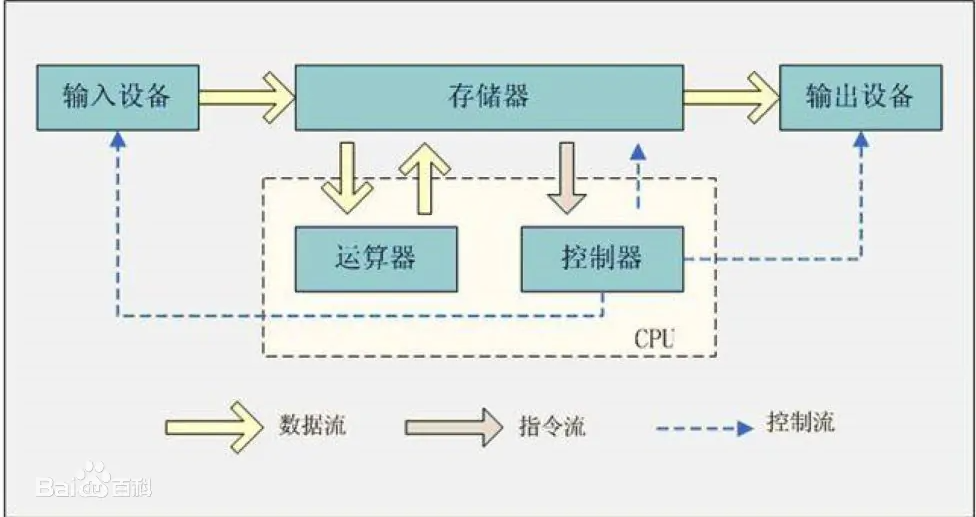
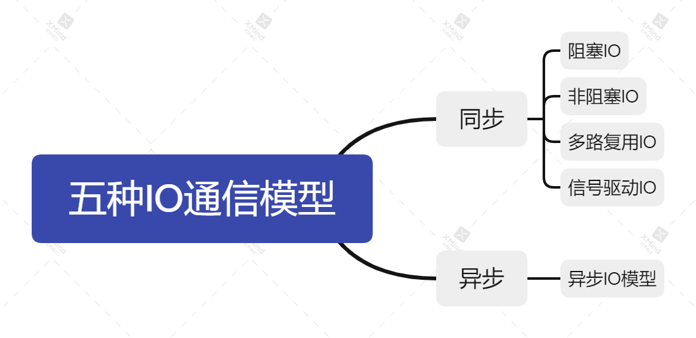

[toc]

---

# 大纲

1. 输入输出是什么
2. 计算机组成原理中冯诺依曼结构的输入输出是什么
3. 网络上的IO
4. 5种IO模型
5. 用户态和系统态
6. Netty的0拷贝和多路复用模型实现

# 正文

## IO

我们讲到输入输出，可能最常见的就是冯诺依曼结构。它将计算机组成分成了5个部分：

1. 运算器
2. 控制器
3. 存储器
4. 输入设备
5. 输出设备

其中常用的键盘和鼠标就是属于输入输出设备，而显示屏属于输出设备。我们通过键盘和鼠标输入信息，通过显示屏看到计算机的输出内容。

那么输入输出到底是什么呢？

在linux中一切都是文件， 而文件是什么呢？文件就是一串二进制流。所以不管是Socket还是队列、终端设备，对我们而言，都是文件，一切都是流。在数据交换的过程中，我们都是对这些流进行数据的收发操作，简称为IO操作。

那计算机里有这么多的流，怎么知道要操作哪个流呢？做到这个的就是文件描述符，即通常所说的fd。

一个fd就是一个整数，对着个fd的操作，就是对这个文件（流）的操作、我们创建一个socket、通过系统调用会返回一个文件描述符、那么剩下对socket的操作就会转化为对这个描述符的操作，这又是一种分层和抽象的思想。

## IO交互过程

IO的分类有内存IO、网络IO和磁盘IO三类。通常说的是后两者。

应用程序发起的一次IO操作包含两个阶段：

- IO调用：应用程序进程向操作系统**内核**发起调用。
- IO执行：操作系统内核完成IO操作。

操作系统内核完成IO操作还包括两个过程：

- 准备数据阶段：内核等待I/O设备准备好数据
- 拷贝数据阶段：将数据从内核缓冲区拷贝到用户进程缓冲区

  

## 五种IO模型

- 阻塞、非阻塞 是 线程处理模式
    - 阻塞住就先待命不动
    - 非阻塞就是继续可以处理
- 同步、异步 是 通信模式
    - 同步就是先等待，然后处理完再告诉我
    - 异步就是该干嘛干嘛，处理完给我结果

# 引用

https://www.cnblogs.com/shengguorui/p/11949282.html

https://blog.csdn.net/weixin_31351409/article/details/121782144
